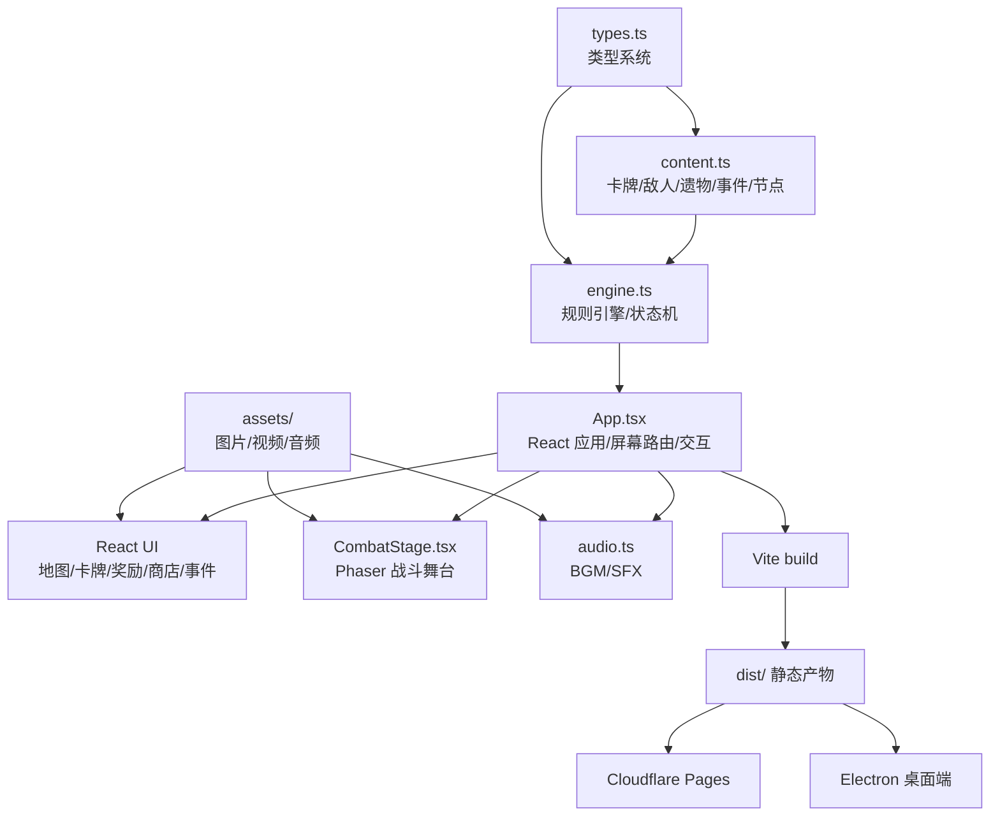
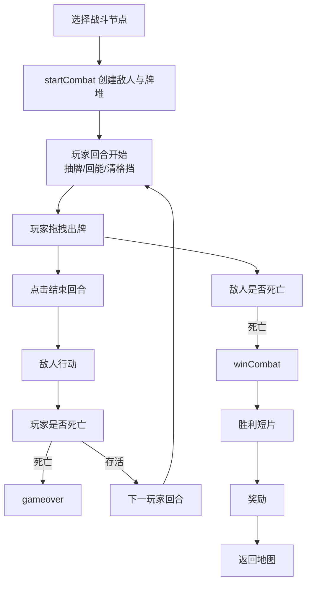

# 《夜巡录：荒庙篇》技术架构与实现说明

版本：v0.2.1  
文档日期：2026-06-02  
对应项目：`night-patrol-spire`  
线上地址：`https://card-game-night-patrol.pages.dev/`  
关联文档：`PRD.md`、`README.md`、`docs/IMPLEMENTATION_DETAILS.md`

## 1. 文档定位

本文档基于当前代码仓库、资源文件、PRD、README 与既有 docs 反推整理，目标是把《夜巡录：荒庙篇》的技术实现讲清楚，形成一份可维护、可扩展、可交接的工程说明书。

它回答的问题包括：

- 当前系统由哪些模块组成。
- React、Phaser、游戏引擎、内容数据、音频、资源和部署之间如何协作。
- 游戏状态如何流转，卡牌、战斗、地图、事件、商店、奖励如何落到代码。
- 后续新增卡牌、敌人、遗物、事件、视频、音效时应该改哪里。
- 哪些地方是当前 demo 的稳定边界，哪些地方是后续规模化前应处理的技术债。

本文档不是 PRD 的重复。PRD 说明产品体验、玩法目标、数值策略和验收口径；本文档说明系统架构、实现细节、工程边界和扩展路径。

## 2. 系统概览

《夜巡录：荒庙篇》是一个静态网页即可运行的志怪题材卡牌构筑 roguelike demo，同时保留 Electron 桌面端打包能力。游戏不依赖后端服务，不需要数据库，不需要实时网络通信。所有核心功能均在浏览器端完成。

当前技术方案可以概括为：

- React 负责页面、交互、状态持有和屏幕切换。
- TypeScript 游戏引擎负责规则、结算和状态机。
- 内容表负责卡牌、敌人、遗物、事件、地图节点文案。
- Phaser 负责战斗舞台的视觉表现，不直接参与规则判断。
- Vite 负责开发服务器与静态资源打包。
- Cloudflare Pages 负责公开静态站点部署。
- Electron 负责桌面客户端外壳和离线包能力。

核心架构原则是：规则和表现分离，数据和流程分离，网页和桌面共享同一套前端构建产物。

## 3. 技术栈

### 3.1 前端运行层

| 技术 | 当前用途 |
| --- | --- |
| React 18 | 游戏 UI、屏幕组件、按钮、卡牌、地图、商店、奖励、事件、结算界面 |
| React DOM | 挂载根应用到 `#app` |
| TypeScript | 游戏类型、状态模型、内容表、规则引擎、组件 props |
| CSS | 全局主题、布局、响应式适配、动效、卡牌样式 |
| Lucide React | 通用 UI 图标，如主页、音量、信息、返回、闪电等 |
| Phaser 3 | 战斗场景、背景、角色、敌人、粒子、镜头震动、受击反馈 |

### 3.2 构建与部署层

| 技术 | 当前用途 |
| --- | --- |
| Vite | 本地开发、模块解析、资源打包、生产构建 |
| TypeScript project build | 构建前类型检查 |
| Cloudflare Pages | 免费静态网站托管 |
| GitHub | 代码托管与公开仓库同步 |
| Electron | 桌面客户端壳 |
| electron-builder | macOS、Windows、Linux 桌面包构建 |

### 3.3 项目运行形态

当前项目支持三种运行形态：

| 形态 | 命令或入口 | 说明 |
| --- | --- | --- |
| 本地开发 | `npm run dev` | 启动 Vite 开发服务器，适合调试 UI 和逻辑 |
| 静态网页 | `npm run build` 后部署 `dist/` | 适合 Cloudflare Pages、GitHub Pages、任意静态托管 |
| 桌面端 | `npm run desktop` / `npm run desktop:dist` | 使用 Electron 加载同一套前端产物 |

## 4. 仓库结构

当前工程结构的职责如下：

```text
.
├── src/
│   ├── main.tsx
│   ├── App.tsx
│   ├── styles.css
│   ├── game/
│   │   ├── types.ts
│   │   ├── content.ts
│   │   ├── engine.ts
│   │   └── audio.ts
│   └── phaser/
│       └── CombatStage.tsx
├── assets/
│   ├── generated/
│   │   ├── backgrounds/
│   │   ├── cinematics/
│   │   ├── characters/
│   │   ├── enemies/
│   │   └── cards/
│   ├── vendor/
│   ├── audio/
│   ├── enemies/
│   └── ui/
├── electron/
│   └── main.cjs
├── docs/
│   ├── PLANNING.md
│   ├── FIRST_ACT_DEMO_ROADMAP.md
│   ├── IMPLEMENTATION_DETAILS.md
│   └── PACKAGING_DISTRIBUTION.md
├── PRD.md
├── TECHNICAL_ARCHITECTURE.md
├── README.md
├── package.json
├── vite.config.ts
└── index.html
```

### 4.1 关键源码职责

| 文件 | 主要职责 |
| --- | --- |
| `src/main.tsx` | React 应用入口，挂载根组件 |
| `src/App.tsx` | 游戏 UI 总入口、屏幕路由、交互事件、拖拽出牌、音效触发 |
| `src/styles.css` | 视觉主题、布局、卡牌、地图、响应式、移动端适配 |
| `src/game/types.ts` | 游戏状态、卡牌、敌人、事件、商店、奖励等类型定义 |
| `src/game/content.ts` | 卡牌池、敌人模板、遗物、事件、节点文案等内容数据 |
| `src/game/engine.ts` | 游戏状态机、战斗规则、地图生成、奖励、商店、事件结算 |
| `src/game/audio.ts` | BGM、音效、静音开关、浏览器音频解锁 |
| `src/phaser/CombatStage.tsx` | Phaser 战斗舞台的 React 包装与视觉同步 |
| `electron/main.cjs` | Electron BrowserWindow、桌面端加载和窗口配置 |

## 5. 总体架构

系统可以拆成六层：

1. 内容层：卡牌、敌人、遗物、事件、路线节点、资源路径。
2. 规则层：游戏状态机、战斗结算、随机、奖励、商店、事件。
3. 应用层：React 持有 `GameState`，调用规则函数产生新状态。
4. 表现层：React 页面与 Phaser 战斗舞台。
5. 资源层：图片、视频、音频、SVG、图标。
6. 分发层：Vite 静态构建、Cloudflare Pages、Electron。



这套结构的重点是：`engine.ts` 不认识 DOM，不播放音频，不知道 Phaser；`CombatStage.tsx` 不决定卡牌是否能打、不计算伤害、不推进回合；`App.tsx` 是两者之间的协调者。

## 6. 状态模型

所有可玩的游戏状态都收敛在 `GameState` 中。React 使用 `useState<GameState>` 持有当前状态，任何玩家操作都会通过规则函数更新状态。

### 6.1 GameState 核心字段

| 字段 | 含义 |
| --- | --- |
| `screen` | 当前界面，如标题、地图、战斗、奖励、事件、商店、结局 |
| `difficulty` | 难度，包含 `story`、`normal`、`hard` |
| `player` | 玩家生命、能量、金币、香火、牌组、遗物、状态 |
| `floor` | 当前路线层数 |
| `mapNodes` | 本局生成的地图节点 |
| `availableNodeIds` | 当前可选择节点 |
| `currentNodeId` | 当前所在节点 |
| `visitedNodeIds` | 已访问节点 |
| `combat` | 战斗状态，无战斗时为 `null` |
| `cinematic` | 战斗胜利后的短片状态 |
| `reward` | 当前奖励内容 |
| `event` | 当前事件内容 |
| `shop` | 当前商店内容 |
| `pendingRemove` | 删除卡牌流程的临时状态 |
| `pendingUpgrade` | 升级卡牌流程的临时状态 |
| `log` | 夜巡札记日志 |
| `seed` | 伪随机种子 |
| `nextCardUid` | 卡牌实例唯一编号 |
| `lastFx` | 本次状态更新希望播放的音效信号 |

### 6.2 状态设计的优点

- 状态集中：调试时只要看 `GameState`，就能知道游戏此刻处于哪里。
- 流程明确：屏幕切换不是散落在 DOM 事件中，而是由规则函数更新 `screen`。
- 可序列化潜力强：大部分状态都是普通对象，未来做存档、回放、debug 面板会更容易。
- 规则可测试：`engine.ts` 理论上可以脱离 React 做单元测试。

### 6.3 当前状态边界

当前没有持久化存档，也没有把 `GameState` 写入 localStorage。刷新页面会重新开始。对 demo 来说这是合理的，因为能避免旧版本状态污染新版本规则；如果后续要长线试玩，应增加版本化存档结构。

## 7. 内容数据架构

`src/game/content.ts` 是当前项目的内容中心。它保存了大量策划内容，是游戏可扩展性的关键文件。

### 7.1 卡牌内容

卡牌定义使用 `CardDef`：

| 字段 | 含义 |
| --- | --- |
| `id` | 程序识别用唯一 ID |
| `name` | 中文牌名 |
| `type` | `attack`、`skill`、`power`、`status` |
| `rarity` | 稀有度 |
| `cost` | 能量消耗，或 `-` 表示不可正常打出 |
| `text` | 未升级与升级后的两段描述 |
| `exhaust` | 是否打出后消耗 |
| `unplayable` | 是否不可打出 |

卡牌实例使用 `CardInstance`。定义和实例分离很重要：

- `CardDef` 是一张牌的静态规则说明。
- `CardInstance` 是玩家牌组里具体的一张牌，包含 `uid` 和 `upgraded`。

这意味着玩家可以同时拥有多张同名牌，每张牌都能独立升级、删除、进入抽牌堆或弃牌堆。

### 7.2 敌人内容

敌人使用 `EnemyTemplate` 定义：

- 基础生命值。
- 美术 key。
- 行动列表。
- 是否精英。
- 是否 boss。

战斗开始时，引擎会从模板复制出 `EnemyState`，额外加入：

- `maxHp`
- `block`
- `strength`
- `seal`
- `weak`
- `vulnerable`
- `intent`

这种设计让敌人模板保持纯内容，而战斗中的临时状态不会污染原始模板。

### 7.3 遗物内容

遗物使用 `RelicDef` 定义。当前遗物主要由引擎在特定钩子中处理，例如：

- 进入战斗时给格挡。
- 回合开始时给资源或状态。
- 获得时触发金币奖励。
- 特定卡牌或战斗行为后影响结算。

当前遗物效果还没有形成统一的事件钩子系统，而是分布在引擎逻辑里。这对 demo 足够直接，但后续遗物数量扩大后，建议建立统一钩子表。

### 7.4 事件内容

事件使用 `EventDef` 定义：

- `title`：事件标题。
- `body`：事件正文。
- `choices`：选项列表。

事件选项的最终效果在 `engine.ts` 中结算。这样可以让文案集中在内容表，效果集中在规则引擎。

### 7.5 节点内容

地图节点类型包括：

- 普通战斗 `combat`
- 精英战斗 `elite`
- 事件 `event`
- 休整 `rest`
- 商店 `shop`
- Boss `boss`

节点文案由内容表提供，节点生成和路线连接由引擎处理。

## 8. 规则引擎架构

`src/game/engine.ts` 是当前游戏的规则核心。它负责创建新局、生成路线、推进节点、开始战斗、结算卡牌、处理敌人回合、发放奖励、处理事件和商店。

### 8.1 引擎设计方式

引擎函数采用“传入状态对象并修改”的方式工作。React 侧会先复制一份状态草稿，再把草稿交给引擎函数修改，最后用新状态刷新界面。

在 `App.tsx` 中，这个流程由 `transact` 完成：

1. 使用 `structuredClone(game)` 复制当前状态。
2. 执行传入的规则函数。
3. 更新 React state。
4. 根据 `lastFx` 播放对应音效。

这种方案介于纯 immutable reducer 和直接 mutation 之间：

- 对 UI 来说，每次仍然拿到新对象，React 可以正常刷新。
- 对引擎来说，代码写法直接，不需要每一步都手写深层拷贝。
- 对当前 demo 来说，复杂度和可读性比较平衡。

### 8.2 随机系统

当前随机使用基于 `state.seed` 的线性同余生成器：

```text
state.seed = state.seed * 48271 % 2147483647
```

它用于：

- 抽牌堆洗牌。
- 地图生成。
- 奖励卡牌选择。
- 奖励遗物选择。
- 商店商品。
- 事件抽取。
- 敌人选择。

优点：

- 不依赖 `Math.random()` 的隐式全局状态。
- 理论上可以支持同种子复现。
- 对调试路线、奖励和战斗结果有帮助。

当前限制：

- 初始 seed 仍由创建状态时生成。
- UI 暂未暴露 seed。
- 暂无回放系统。

后续如果要做挑战种子、每日挑战或赛事榜单，应把 seed 暴露到新局入口，并把每次玩家选择记录成 action log。

### 8.3 新局创建

新局创建由 `createGameState` 和 `startRun` 共同完成。

创建初始状态时会设置：

- 初始 screen。
- 玩家为空或待创建。
- 初始 floor。
- 空地图和空战斗。
- 初始随机种子。
- 初始日志。

开始游戏后会根据难度创建玩家：

- 生命上限。
- 香火。
- 金币。
- 起始牌组。
- 初始遗物或资源策略。

随后生成地图，把玩家送到路线选择界面。

### 8.4 难度系统

难度在引擎中通过配置控制。当前包含：

| 难度 | 设计定位 |
| --- | --- |
| `story` | 偏剧情体验，容错较高 |
| `normal` | 标准玩法 |
| `hard` | 更强压力和更高失败风险 |

难度会影响初始生命、香火、金币、敌人血量或相关压力参数。当前架构适合继续扩展为更多配置项，例如：

- 敌人伤害倍率。
- 奖励金币倍率。
- 精英节点密度。
- 商店价格倍率。
- Boss 强化。

建议未来把难度配置进一步表格化，避免分散在流程分支中。

### 8.5 地图生成

地图由多行节点组成，每个节点有：

- `id`
- `row`
- `lane`
- `type`
- `nextIds`

当前路线设计强调“选择路径”的 roguelike 体验，而不是开放世界移动。节点生成后，引擎会维护当前可选节点列表。

地图节点选择流程：

1. 玩家在地图界面点击可用节点。
2. 引擎验证节点是否在 `availableNodeIds`。
3. 写入当前节点和访问记录。
4. 根据节点类型进入不同 screen：
   - 战斗节点进入战斗。
   - 事件节点进入事件。
   - 休整节点进入休整。
   - 商店节点进入商店。
   - Boss 节点进入 boss 战。

### 8.6 战斗生命周期

一次战斗的生命周期如下：



战斗状态中维护：

- 抽牌堆。
- 弃牌堆。
- 消耗堆。
- 手牌。
- 当前回合数。
- 本回合已打牌数量。
- 本回合是否打过攻击牌。
- 敌人状态。
- 战斗舞台 pulse 和 hitTarget。

### 8.7 抽牌与牌堆

牌堆分为：

- `drawPile`
- `discardPile`
- `exhaustPile`
- `hand`

当抽牌堆不足时，弃牌堆会洗回抽牌堆。打出的牌根据规则进入弃牌堆或消耗堆。状态牌可设置不可打出。

这种设计符合卡牌构筑类游戏的基本模型，也方便未来实现：

- 检索抽牌堆。
- 操作弃牌堆。
- 消耗区回收。
- 临时牌。
- 复制牌。

### 8.8 卡牌打出流程

玩家在 UI 上拖拽卡牌时，React 负责判断指针位置和目标类型；真正能否打出、消耗能量、产生效果由引擎处理。

基础流程：

1. UI 判断卡牌是否可交互。
2. 玩家按下并拖拽卡牌。
3. UI 根据卡牌类型决定合法目标：
   - 攻击牌指向敌人。
   - 技能牌和能力牌指向玩家侧。
   - 状态牌通常不可打出。
4. 松手时调用 `playCard`。
5. 引擎验证费用、手牌、目标和战斗状态。
6. 引擎扣除能量并结算效果。
7. 引擎移动卡牌到弃牌堆或消耗堆。
8. UI 根据新状态刷新。

### 8.9 卡牌效果解析

当前卡牌效果在 `resolveCard` 中以手写分支处理。它根据卡牌 `id` 执行不同规则。

这套方式的优点：

- 直观。
- 适合 demo 阶段快速迭代。
- 每张牌可写特殊逻辑。

限制：

- 卡牌数量扩大后，分支会变长。
- 内容设计和程序实现耦合较高。
- 不利于策划直接维护数值表。

后续推荐演进方向：

```text
CardDef
  -> effects: Effect[]
  -> engine effect resolver
  -> test cases per effect
```

示例效果结构可以包括：

- `damage`
- `block`
- `draw`
- `gainEnergy`
- `applySeal`
- `applyWeak`
- `applyVulnerable`
- `exhaust`
- `createTempCard`
- `conditional`

等到卡牌数量达到 40 至 60 张以上时，再引入效果 DSL 会更合适。

### 8.10 敌人行动

敌人模板包含行动列表。战斗中敌人会持有当前意图 `intent`。敌人回合时，引擎根据 intent 执行：

- 攻击。
- 多段攻击。
- 格挡。
- 攻防一体。
- 增益。
- 负面状态。
- 塞入状态牌或诅咒牌。

敌人行动后，引擎会切换下一意图，使玩家能提前看到压力并做策略选择。

### 8.11 状态与伤害

当前核心战斗状态包括：

- `block`：格挡，抵消伤害。
- `weak`：虚弱，影响输出。
- `vulnerable`：易伤，影响承伤。
- `seal`：符印，满足条件时触发额外效果。
- `strength`：敌人力量。

伤害结算由引擎集中处理，避免 UI 和 Phaser 各自计算。这样可以保证视觉表现只反映结果，不创造规则分歧。

### 8.12 胜利、短片与奖励

战斗胜利后不是立即回地图，而是进入一段胜利短片 screen。该流程由 `CinematicState` 描述：

- 敌人 ID。
- 敌人名。
- 敌人图像 key。
- 战斗类型。
- 短片标题。
- 副标题。
- 视频 URL。
- poster URL。
- 下一屏幕。
- 奖励摘要。

短片结束后进入奖励或胜利结局。奖励包括金币、遗物和卡牌选择。卡牌选择后会把新卡实例加入玩家牌组，再返回地图。

### 8.13 事件、休整与商店

事件：

- 从内容表抽取事件。
- 玩家选择选项。
- 引擎结算生命、金币、卡牌、遗物或其他结果。
- 返回地图。

休整：

- 支持回血。
- 支持升级卡牌。
- 通过 `pendingUpgrade` 进入卡牌选择流程。

商店：

- 随机生成售卖卡牌。
- 随机生成遗物。
- 支持删牌。
- 通过 `pendingRemove` 进入卡牌选择流程。
- 购买后设置 sold，避免重复购买。

## 9. React 应用架构

`src/App.tsx` 是当前前端应用的中枢。它承担四类责任：

1. 持有 `GameState`。
2. 根据 `screen` 渲染对应界面。
3. 接收用户交互并调用引擎函数。
4. 连接音频、视频、Phaser 战斗舞台和资源。

### 9.1 屏幕路由

当前 screen 包括：

| Screen | 界面 |
| --- | --- |
| `title` | 标题页与难度选择 |
| `about` | 说明/署名页 |
| `map` | 路线地图 |
| `combat` | 战斗 |
| `cinematic` | 胜利短片 |
| `reward` | 战斗奖励 |
| `event` | 事件 |
| `rest` | 休整 |
| `shop` | 商店 |
| `remove` | 删除卡牌选择 |
| `upgrade` | 升级卡牌选择 |
| `gameover` | 失败结局 |
| `victory` | 通关结局 |

React 通过条件渲染选择当前 screen 对应组件。这个方案在 demo 阶段足够清晰；未来如果 screen 增多，可以拆成 `screens/` 目录并建立 screen registry。

### 9.2 顶部 HUD

`TopHud` 负责显示：

- 角色头像或徽章。
- 生命值。
- 金币。
- 牌组数量。
- 遗物数量。
- 地图进度。
- 主页、音量、信息、返回等快捷按钮。

顶部 HUD 在桌面和移动端都需要保持稳定，因此样式中对间距、按钮尺寸、横向滚动和粘性布局有专门处理。

### 9.3 地图界面

地图界面将 `mapNodes` 投影成路线图：

- 行表示路线层。
- 列表示横向 lane。
- 连线表示可达路径。
- 节点状态区分已访问、可选、锁定。

玩家只能点击 `availableNodeIds` 中的节点，避免越级选择。

### 9.4 战斗界面

战斗界面由两部分组成：

- 上方 Phaser 战斗舞台。
- 下方 React 手牌和操作区。

这样做的原因是：战斗角色和场景动效适合 Phaser；手牌、费用、按钮、拖拽反馈、文字排版更适合 React。

### 9.5 拖拽出牌

拖拽状态由 React 维护。主要信息包括：

- 当前拖拽的卡牌 uid。
- 起始点。
- 当前指针位置。
- 命中目标。

拖拽过程中 UI 会显示卡牌投影和目标提示。松手后，如果目标合法，则调用引擎打牌；如果目标不合法，则取消拖拽。

移动端适配中，拖拽需要兼容触控指针，因此事件处理尽量围绕 pointer events 设计。

### 9.6 日志系统

右侧或下方的“夜巡札记”展示 `log` 内容。日志承担三个作用：

- 记录玩家关键收益。
- 反馈战斗伤害和状态变化。
- 提供局内叙事氛围。

日志样式会根据内容类型做视觉区分，例如战斗、收获、整备等。

## 10. Phaser 战斗舞台架构

`src/phaser/CombatStage.tsx` 把 Phaser 嵌入 React。它不是另一个游戏引擎，而是战斗表现层。

### 10.1 组件生命周期

React 组件挂载时：

1. 创建容器 DOM。
2. 创建 Phaser.Game。
3. 注册 `NightBattleScene`。
4. 加载背景、玩家和敌人素材。

React 状态变化时：

1. 生成新的 `StageSnapshot`。
2. 传给 Phaser scene。
3. Phaser 更新角色、敌人、生命条、意图、动画和镜头效果。

组件卸载时：

1. 销毁 Phaser.Game。
2. 清理容器。

### 10.2 Snapshot 模型

Phaser 接收的不是完整 `GameState`，而是简化后的 `StageSnapshot`：

- 敌人 key、名称、生命、格挡、符印、意图。
- 玩家生命、格挡。
- pulse。
- hitTarget。

这可以降低耦合：

- Phaser 不需要知道牌组、商店、地图、奖励。
- UI 状态结构变化时，不一定影响战斗舞台。
- 战斗舞台只负责“把当前战况画出来”。

### 10.3 资源加载

敌人和玩家图像通过 URL 导入后交给 Phaser loader。背景图同理。每个敌人有对应尺寸参数，避免不同素材在舞台中显得过大或过小。

当前还保留了部分 SVG 敌人资源，但主要战斗表现使用生成 PNG 资源。

### 10.4 动效反馈

Phaser 当前承担：

- 战斗背景呈现。
- 玩家与敌人站位。
- 生命条与状态文字。
- 受击动画。
- 镜头 shake。
- 命中目标高亮。
- 简单氛围粒子。

其中 `pulse` 是 React/引擎传给 Phaser 的节拍信号。每次战斗发生关键动作时，pulse 变化，Phaser 据此播放一次反馈动画。

### 10.5 响应式处理

Phaser 舞台在紧凑宽度下会隐藏部分文字信息，避免移动端出现拥挤。完整信息仍由 React UI 和日志承担，因此不会影响玩法理解。

## 11. 音频架构

`src/game/audio.ts` 封装了 `RitualAudio`。它负责：

- 背景音乐。
- 音效播放。
- 静音状态。
- 浏览器音频解锁。
- 不同 BGM 模式。

### 11.1 BGM

当前 BGM 使用一首主循环音频，通过模式控制音量和播放状态：

- 标题页音量更高，强化进入感。
- 游戏内音量更低，作为氛围底色。
- 静音时暂停或降低播放。

### 11.2 音效

音效按语义触发，而不是由 UI 直接写具体文件：

| `lastFx` | 语义 |
| --- | --- |
| `card` | 打牌 |
| `hit` | 命中 |
| `impact` | 重击 |
| `fire` | 火系效果 |
| `lightning` | 雷系效果 |
| `charge` | 蓄力 |
| `block` | 格挡 |
| `reward` | 获得奖励 |
| `danger` | 危险或失败反馈 |

这种设计使规则引擎只需输出“发生了什么”，音频层决定“怎么响”。

### 11.3 浏览器限制

现代浏览器通常要求用户交互后才能播放音频。当前音频模块通过用户点击后的初始化来规避自动播放限制。播放失败会被捕获，不会阻塞游戏流程。

## 12. 资源与素材管线

项目素材主要在 `assets/` 中。

### 12.1 素材类型

| 目录 | 内容 |
| --- | --- |
| `assets/generated/backgrounds/` | 背景图与背景视频 |
| `assets/generated/cinematics/` | 战斗胜利短片与 poster |
| `assets/generated/characters/` | 玩家角色 |
| `assets/generated/enemies/` | 敌人 PNG |
| `assets/generated/cards/` | 卡牌相关视觉 |
| `assets/audio/bgm/` | BGM |
| `assets/audio/sfx/` | 音效 |
| `assets/vendor/` | 外部或整理素材包 |
| `assets/ui/` | UI 装饰资源 |

### 12.2 Vite 资源处理

源码中通过 `new URL(..., import.meta.url)` 引入图片、视频和音频。Vite 构建时会：

- 解析资源依赖。
- 拷贝资源到 `dist/assets/`。
- 生成带 hash 的文件名。
- 更新代码中的引用路径。

因此 Cloudflare Pages 部署 `dist/` 时，图片、音频、视频会随静态资源一起上传。

### 12.3 视频与 poster

胜利短片配有 poster 图。这样做有三个好处：

- 视频加载前有静态预览。
- 视频播放失败时仍有画面。
- 移动端和弱网环境体验更稳定。

### 12.4 素材一致性要求

为了保证本地、GitHub 和 Cloudflare Pages 的呈现一致：

- 不应手动改 `dist/` 中的 hash 文件作为长期方案。
- 所有源素材应放在 `assets/`。
- 所有资源引用应从源码入口导入。
- 每次上线前运行 `npm run build`。
- Cloudflare Pages 应部署最新构建产物或连接 GitHub 自动构建。

## 13. 样式与响应式架构

`src/styles.css` 是当前视觉系统的主要承载文件。它定义了：

- 全局色彩。
- 字体和字号。
- 背景层。
- 顶部 HUD。
- 页面容器。
- 卡牌样式。
- 地图节点。
- 商店和奖励布局。
- 战斗界面。
- 移动端适配。

### 13.1 桌面端设计

桌面端目标是完整展示：

- 顶部 HUD。
- 大面积背景。
- 地图/战斗/商店主要内容。
- 右侧日志或辅助信息。
- 卡牌手牌区。

桌面端以横向空间为优势，强调“战斗舞台 + 操作面板”的沉浸感。

### 13.2 移动端设计

移动端目标不是把桌面端等比例缩小，而是保证：

- 页面可以纵向滚动。
- 顶部 HUD 不遮挡核心内容。
- 卡牌、地图、商店和日志可读。
- 战斗操作区能触控。
- 视频和图片不会把版面撑坏。

移动端样式通过 media query 调整：

- 页面高度从固定视口转为可滚动。
- 主舞台从横向布局转为纵向布局。
- 卡牌网格减少列数。
- 地图区域允许横向或局部滚动。
- HUD 在窄屏下更紧凑。

### 13.3 响应式风险点

该项目的响应式难点主要来自：

- roguelike 地图天然横向信息密度高。
- 手牌拖拽需要触控精度。
- 战斗舞台和 UI 同屏时容易挤压。
- 顶部 HUD 信息多。
- 视频和背景资源尺寸大。

后续每次改 UI 都应至少验证：

- 桌面 1920x1080。
- 笔记本 1440x900。
- 手机竖屏 390x844。
- 手机横屏 844x390。

## 14. 构建、部署与桌面端

### 14.1 npm scripts

| 命令 | 用途 |
| --- | --- |
| `npm run dev` | 本地开发 |
| `npm run build` | TypeScript 检查并构建静态产物 |
| `npm run preview` | 本地预览生产构建 |
| `npm run desktop` | 构建后启动 Electron |
| `npm run desktop:pack` | 构建桌面目录包 |
| `npm run desktop:dist` | 构建正式桌面发行包 |

### 14.2 Vite 配置

`vite.config.ts` 中使用 React 插件，并设置：

- `base: "./"`，保证静态资源在子路径和 file 环境下也能相对加载。
- 开发服务器 host 为 `127.0.0.1`。
- 默认端口为 `5173`。

`base: "./"` 对 Electron 和静态托管都重要，因为它降低了部署路径变化带来的资源 404 风险。

### 14.3 Cloudflare Pages

Cloudflare Pages 部署建议：

- 构建命令：`npm run build`
- 输出目录：`dist`
- Node 版本：使用 Cloudflare 当前稳定 Node 环境即可。
- 如遇 Electron 二进制下载问题，可设置 `ELECTRON_SKIP_BINARY_DOWNLOAD=1`。

由于游戏是纯静态站点，Cloudflare Pages 不需要后端函数即可运行完整功能。

### 14.4 Electron 桌面端

Electron 入口在 `electron/main.cjs`。它负责：

- 创建主窗口。
- 设置窗口尺寸和最小尺寸。
- 加载开发服务器或 `dist/index.html`。
- 启用沙箱和上下文隔离。
- 禁用不必要菜单。

当前 Electron 只作为壳加载前端，不引入 Node 侧游戏逻辑。因此网页端和桌面端规则一致。

## 15. 错误处理与稳定性

当前工程在多个层面做了基础防护。

### 15.1 引擎防护

规则引擎中有辅助函数确保关键状态存在，例如玩家和战斗状态。对于非法操作，引擎通常会提前返回或避免继续执行。

典型场景：

- 非战斗状态下不能打牌。
- 不在手牌中的卡不能打出。
- 能量不足不能打出卡牌。
- 不可用地图节点不能进入。
- 商店售罄商品不能重复购买。
- 金币不足不能购买或删牌。

### 15.2 UI 防护

UI 层会禁用或弱化不可操作项，例如：

- 锁定地图节点。
- 售罄商品。
- 无法打出的状态牌。
- 当前无待选内容的流程。

UI 防护提升体验，但真正的规则判定仍应以引擎为准。

### 15.3 媒体防护

音频播放失败会捕获，不影响游戏。视频有 poster，减少空白画面风险。

### 15.4 当前缺口

当前还缺少：

- 自动化单元测试。
- 端到端测试。
- 内容 schema 校验。
- 存档兼容性策略。
- 异常上报。

这些不影响 demo 运行，但会影响长期维护效率。

## 16. 测试策略

### 16.1 当前可执行验证

当前最基础的验证是：

```bash
npm run build
npm run preview
```

然后在浏览器中检查：

- 标题页是否正常显示。
- 三档难度能否开始。
- 地图能否选择节点。
- 战斗能否出牌、结束回合、获胜或失败。
- 奖励、事件、休整、商店能否返回地图。
- 视频、图片、音频是否加载。
- 桌面端和手机端是否可滚动、可点击、可读。

### 16.2 建议补齐的单元测试

优先给 `engine.ts` 建测试，因为它是规则核心。

推荐测试集合：

| 模块 | 测试内容 |
| --- | --- |
| 新局 | 三档难度初始生命、金币、香火、牌组 |
| 地图 | 生成节点数量、boss 节点、路径连通性、可选节点 |
| 抽牌 | 洗牌、弃牌堆回洗、手牌数量 |
| 打牌 | 费用、伤害、格挡、抽牌、消耗、不可打出 |
| 状态 | 虚弱、易伤、符印、力量 |
| 敌人回合 | 攻击、格挡、buff、debuff、多段攻击 |
| 胜利 | 奖励生成、短片状态、返回地图 |
| 商店 | 价格、售罄、删牌、金币不足 |
| 事件 | 每个选项的结算结果 |
| 随机 | 固定 seed 的结果一致性 |

### 16.3 建议补齐的浏览器测试

推荐用 Playwright 或同类工具覆盖：

- 进入游戏完整路径。
- 手机竖屏地图滚动。
- 手机竖屏战斗拖拽。
- 桌面端战斗舞台不空白。
- 视频 poster 显示。
- 商店购买流程。
- 休整升级流程。
- Cloudflare 生产站点 smoke test。

### 16.4 测试优先级

如果时间有限，测试优先级建议：

1. 引擎单元测试。
2. 移动端页面可用性测试。
3. 战斗拖拽端到端测试。
4. 资源加载测试。
5. Electron 启动测试。

## 17. 扩展指南

### 17.1 新增卡牌

推荐步骤：

1. 在 `content.ts` 增加 `CardDef`。
2. 如果卡牌进入奖励池，把 ID 加入对应池。
3. 在 `engine.ts` 的卡牌效果解析中增加效果。
4. 如有特殊视觉或音效，在 UI 或 audio 映射中补充。
5. 增加单元测试。
6. 验证奖励、商店、升级、删除流程都能处理该卡。

注意事项：

- 每张进入玩家牌组的牌都必须有实例 uid。
- 升级文案和未升级文案都要写。
- 如果卡牌不可打出，应设置 `unplayable` 和合适 cost。
- 如果卡牌会消耗，应设置 `exhaust` 或在规则中移动到消耗堆。

### 17.2 新增敌人

推荐步骤：

1. 在 `content.ts` 增加敌人模板。
2. 准备敌人素材。
3. 在 `CombatStage.tsx` 的敌人图像映射中加入资源。
4. 根据素材比例配置舞台尺寸。
5. 如果需要胜利短片，在 cinematic 映射中加入 video 和 poster。
6. 在敌人选择逻辑中放入对应楼层或节点类型。
7. 测试普通、精英或 boss 流程。

注意事项：

- 敌人行动列表要能循环或稳定选择。
- Boss 应有足够辨识度和更明确的阶段压力。
- 精英敌人应对应更高奖励。

### 17.3 新增遗物

推荐步骤：

1. 在 `content.ts` 增加 `RelicDef`。
2. 选择触发时机：
   - 获得时。
   - 战斗开始。
   - 回合开始。
   - 打出特定类型牌时。
   - 造成伤害后。
   - 获得奖励时。
3. 在 `engine.ts` 对应流程加入效果。
4. 增加日志反馈。
5. 加入测试。

如果遗物数量继续增长，建议抽象为：

```text
RelicHook
  onGain
  onCombatStart
  onTurnStart
  onCardPlayed
  onDamageDealt
  onReward
```

这样可以降低引擎主流程中的分支密度。

### 17.4 新增事件

推荐步骤：

1. 在 `content.ts` 添加事件文案和选项。
2. 在 `engine.ts` 添加选项结算。
3. 检查低生命、金币不足、牌组为空等边界。
4. 增加日志。
5. 测试事件出现、选择、返回地图。

事件设计应避免“所有选项都明显同质”。最好每个事件提供：

- 稳定收益。
- 高风险收益。
- 放弃或保守选项。

### 17.5 新增节点类型

新增节点类型需要改动范围更大：

1. `types.ts` 扩展 `NodeType`。
2. `content.ts` 增加节点文案。
3. `engine.ts` 地图生成和节点选择逻辑支持新类型。
4. `App.tsx` 增加 screen 或对应 UI。
5. `styles.css` 增加样式。
6. 增加测试。

例如后续可以新增：

- 宝箱。
- 剧情。
- 诅咒。
- 试炼。
- 随机商人。

### 17.6 新增短片

推荐步骤：

1. 把 mp4 放入 `assets/generated/cinematics/`。
2. 把 poster 放入同目录。
3. 在 `App.tsx` 的短片资源映射中增加敌人 ID 对应项。
4. 验证构建后资源进入 `dist/assets/`。
5. 验证移动端 poster 与视频比例。

短片应控制体积，避免首屏或胜利流程加载过慢。

## 18. 性能分析

### 18.1 当前性能特征

当前游戏主要性能压力来自：

- 背景视频。
- 胜利短片。
- 战斗舞台 Phaser 渲染。
- 大量背景图和敌人 PNG。
- 移动端复杂 CSS 与固定背景。

规则引擎本身计算量很小，不是瓶颈。

### 18.2 优化策略

推荐优先级：

1. 保持首屏资源轻量，避免一次性加载所有视频。
2. 对短片和大图做合理压缩。
3. 使用 poster 保底。
4. 移动端降低部分背景固定和滤镜压力。
5. Phaser 场景只在战斗页创建。
6. 避免在每帧把完整 GameState 传给 Phaser。

### 18.3 当前资源体积风险

当前 dist 体积主要由视频和图片决定。Cloudflare Pages 可以承载当前资源，但后续如果短片数量增加，需要建立资源预算：

- 单个视频建议控制在 15MB 以内。
- 关键图片建议控制在 1MB 至 3MB 以内。
- 首屏直接依赖资源越少越好。
- 非首屏短片可以延迟加载。

## 19. 安全与合规

### 19.1 Web 安全

当前网页没有后端、没有用户登录、没有用户数据上传，因此安全面相对小。主要风险是：

- 第三方资源许可。
- 静态托管配置错误。
- XSS 风险较低，因为内容来自本地代码而非用户输入。

### 19.2 Electron 安全

Electron 当前启用：

- `sandbox`
- `contextIsolation`
- 禁止 Node 集成到渲染层

这是正确方向。后续如果增加本地文件读写、存档或插件能力，需要重新评估权限边界。

### 19.3 版权与授权

仓库中存在多类素材：

- 生成素材。
- vendor 素材。
- 音频素材。
- 代码。

应持续维护：

- `LICENSE`
- `LICENSE-MIT.md`
- `NOTICE.md`
- 各素材目录 README

代码开源授权和素材授权应保持清晰边界，避免把非商用素材误认为 MIT 可商用素材。

## 20. 当前技术债

### 20.1 引擎测试缺失

当前规则复杂度已经超过“只靠手动测试就够”的阶段。尤其是卡牌、遗物、事件、商店和地图生成，建议尽快建立单元测试。

### 20.2 卡牌效果分支会膨胀

`resolveCard` 适合 demo，但卡牌数量增加后会变成维护压力。建议在内容扩充前设计效果 DSL 或效果表。

### 20.3 App.tsx 体积偏大

当前 `App.tsx` 同时负责大量 screen 和交互。后续可以拆分为：

```text
src/screens/
src/components/
src/hooks/
src/assets.ts
```

拆分时要保持引擎边界，不要把规则分散到组件里。

### 20.4 响应式回归风险

移动端适配刚完成基础修复，但地图、战斗拖拽、商店和视频仍是高风险区域。后续应建立固定 viewport 的截图测试。

### 20.5 没有存档系统

当前刷新会丢失进度。若开放给更多玩家长期试玩，建议增加：

- 自动存档。
- 新局覆盖确认。
- 版本号。
- 存档迁移。
- 清除存档。

### 20.6 内容缺少 schema 校验

内容表目前由 TypeScript 类型约束，但还缺少运行时校验。例如：

- 卡牌 ID 重复。
- 奖励池引用不存在卡牌。
- 敌人 artKey 没有对应资源。
- 事件选项没有结算分支。
- 短片映射缺 poster。

建议增加构建期内容校验脚本。

## 21. 推荐演进路线

### 21.1 近期

- 建立引擎单元测试。
- 建立移动端 smoke test。
- 拆分 App 中的 screen 组件。
- 增加内容校验脚本。
- 建立资源体积检查。
- 完善 Cloudflare 自动部署说明。

### 21.2 中期

- 抽象卡牌效果 DSL。
- 抽象遗物 hook 系统。
- 增加存档。
- 增加 seed 输入与每日挑战。
- 完善 Boss 阶段机制。
- 增加更多敌人、事件和路线变化。

### 21.3 长期

- 建立策划表格到内容代码的生成流程。
- 支持多章节。
- 支持成就和图鉴。
- 支持更完整的新手引导。
- 支持数据埋点或匿名 telemetry。
- 支持云端排行榜或挑战分享。

## 22. 开发协作规范建议

为了让项目继续稳定迭代，建议采用以下工作方式：

### 22.1 需求变更

- 玩法或数值变化先更新 PRD 或补充设计说明。
- 技术实现变化更新本文档。
- 素材授权变化更新 NOTICE 或素材目录 README。

### 22.2 代码变更

- 规则变更优先改 `engine.ts`。
- 内容变更优先改 `content.ts`。
- 视觉变更优先改 `styles.css` 或 Phaser stage。
- 部署变更更新 README 和部署文档。

### 22.3 验收变更

每次上线前至少检查：

- `npm run build` 通过。
- 桌面端页面完整。
- 手机端页面可滚动。
- 战斗能完成。
- 奖励能领取。
- 图片、视频、音频存在。

## 23. 总结

当前《夜巡录：荒庙篇》的技术架构已经形成了清晰的 demo 级生产基础：

- 内容集中在 `content.ts`。
- 规则集中在 `engine.ts`。
- 类型集中在 `types.ts`。
- UI 和屏幕流转集中在 `App.tsx`。
- 战斗表现由 Phaser 单独承载。
- 音频由独立模块封装。
- 构建产物为纯静态文件，适合免费公开部署。
- Electron 桌面端复用同一套前端产物。

这套架构的优势是轻量、清楚、容易部署、容易继续扩内容。它当前最需要补强的是自动化测试、内容校验、组件拆分、存档和更系统的效果抽象。

只要后续坚持“规则归引擎、内容归内容表、表现归 React/Phaser、资源归 assets、部署归 dist”的边界，这个项目可以稳定从 demo 扩展成更完整的独立卡牌游戏。
